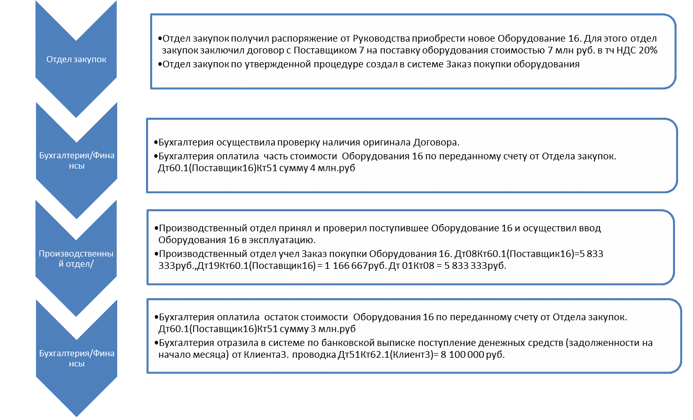

# Начальные бизнес-процессы

В данном разделе представлены подразделения предприятия и функции, которые они должны выполнять.

## Роли и функциональность

**Последовательность действий:**

1. Отдел закупок

	- В Отдел закупок поступил заказ от руководства на закупку нового Оборудования 16. Для этого Отделом закупок был заключен договор с Поставщиком 7 на поставку оборудования на сумму 7 млн. руб., в том числе НДС 20%;
	- Согласно утвержденной процедуре, Отделом закупок сформирован заказ на закупку оборудования в системе.

2. Бухгалтерия/Финансы

	- Бухгалтерия проверила наличие оригинала договора;
	- Бухгалтерия оплатила часть стоимости Оборудования 16 по счету Отдела закупок;
	- Проводка Дт60.1(Поставщик7)Кт51 на сумму 4 млн руб.

3. Производственный отдел

	- Производственный отдел принял и проверил полученное Оборудование 16 и провел пуско-наладочные работы;
	- Производственным отделом учтена закупка оборудования Оборудование 16;
	- Проводка Дт08Кт60.1(Поставщик7) = 5 833 333 руб., Дт19Кт60.1(Поставщик7) = 1 166 667 руб., Дт 01Кт08 = 5 833 333 руб.

4. Бухгалтерия/Финансы

	- Бухгалтерия оплатила остаток стоимости Оборудования 16 по переданному счету из Отдела закупок;
	- Проводка Дт60.1(Поставщик7)Кт51 на сумму 3 млн руб.;
	- Бухгалтерия отразила в системе, по выписке банка, поступление денежных средств (задолженность на начало месяца) от Клиента 3;
	- Проводка Дт51Кт62.1(Клиент3) = 8 100 000 руб.

## Графическое представление

 

Рисунок 1 - Начальные бизнес процессы

