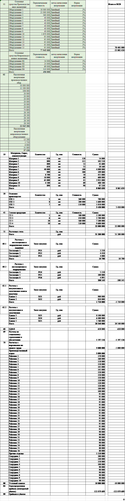
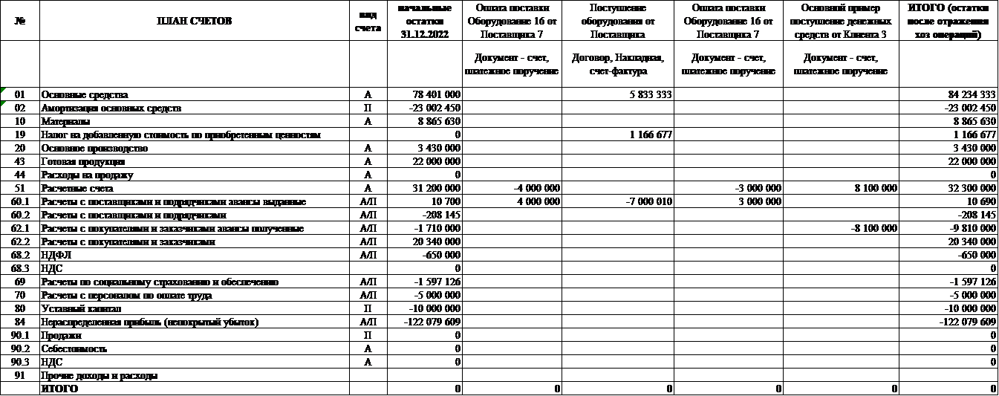
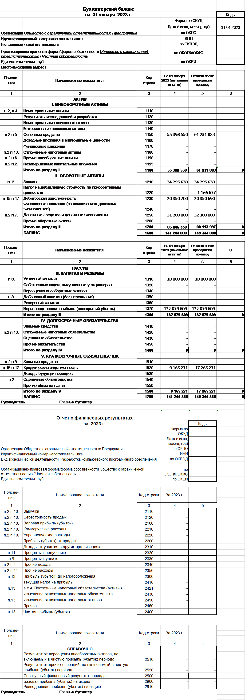

# Таблицы рассчетов

Этот раздел содержит таблицы с информацией:

  - о текущем экономическом состоянии предприятия в разрезе конкретной даты и представляет собой информационный отчет (Рисунок 1);
  - о бухгалтерском балансе, содержащем проводки. Проводка представляет собой запись содержания финансово-хозяйственной деятельности предприятия на двух счетах плана - по дебету (с плюсом) и кредиту (с минусом) (Рисунок 2);
  - о финансовом положении компании. предприятий на отчетную дату (Рисунок 3).

## Таблицы

Рисунок 1 - Начальные остатки

 
 

Рисунок 2 - оборотно-сальдовая ведомость, проводки

 
 

Рисунок 3 - Бухгалтерская отчетность

